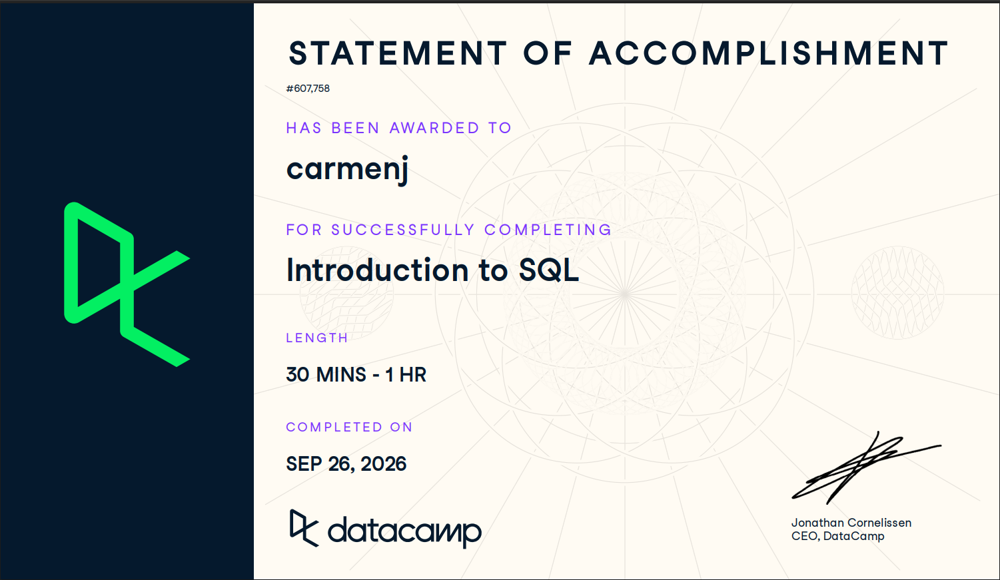

# Course-Completion Evidence

I completed the DataCamp course *Introduction to SQL* on September 26, 2026. This course introduced the fundamentals of relational databases and SQL queries.



# Learning Notes

## Chapter 1: Introduction to Relational Databases

### Main ideas

A relational database stores information in tables. Each table contains rows and columns. Rows represent individual records, while columns represent variables or attributes.

Relational databases are useful because they organize information clearly and allow users to connect related tables.

### SQL syntax

```sql
SELECT *
FROM customers;
```

### Example

This query selects all columns and all records from the `customers` table.

### Application to CEP

In a customer experience project, relational databases could store information about customers, surveys, visits, satisfaction scores, and recommendations.

## Chapter 2: Querying Data

### Main ideas

SQL queries allow users to retrieve specific information from a database. The `SELECT` statement identifies the columns, and the `FROM` statement identifies the table.

### SQL syntax

```sql
SELECT customer_name, satisfaction_score
FROM customer_surveys;
```

### Example

This query retrieves the customer name and satisfaction score from the survey table.

### Application to CEP

This type of query could be used to examine customer satisfaction results from The Restaurant at Kellogg Ranch.

## Chapter 3: Filtering Records

### Main ideas

The `WHERE` clause filters records according to a specific condition. Filtering helps analysts focus on only the data needed for a particular question.

### SQL syntax

```sql
SELECT *
FROM customer_surveys
WHERE satisfaction_score >= 4;
```

### Example

This query returns customers who gave a satisfaction score of four or higher.

### Application to CEP

Filtering could help identify highly satisfied customers or examine responses from a specific customer segment.

## Chapter 4: Aggregate Functions

### Main ideas

Aggregate functions summarize data. Common functions include `COUNT()`, `SUM()`, `AVG()`, `MIN()`, and `MAX()`.

### SQL syntax

```sql
SELECT AVG(satisfaction_score) AS average_satisfaction
FROM customer_surveys;
```

### Example

This query calculates the average customer satisfaction score.

### Application to CEP

Average scores could help evaluate overall satisfaction and compare satisfaction across different customer groups.

## Chapter 5: Grouping and Sorting Data

### Main ideas

The `GROUP BY` clause organizes records into groups. The `ORDER BY` clause sorts the results. These tools make it easier to identify patterns and compare categories.

### SQL syntax

```sql
SELECT visit_month, AVG(satisfaction_score) AS average_score
FROM customer_surveys
GROUP BY visit_month
ORDER BY average_score DESC;
```

### Example

This query calculates the average satisfaction score for each month and displays the months from the highest score to the lowest score.

### Application to CEP

Grouping and sorting could help identify which months, services, or customer segments have the highest satisfaction levels.

## Chapter 6: Joining Tables

### Main ideas

A join combines information from two or more related tables. Tables are usually connected through a common field, such as a customer ID or visit ID.

### SQL syntax

```sql
SELECT customers.customer_name, surveys.satisfaction_score
FROM customers
INNER JOIN surveys
ON customers.customer_id = surveys.customer_id;
```

### Example

This query combines customer information with survey responses using the customer ID.

### Application to CEP

Joining tables could connect customer demographics, survey responses, visit information, and spending behavior.

# Overall Reflection

The *Introduction to SQL* course helped me understand how databases are organized and how SQL can be used to retrieve, filter, summarize, and combine information.

The most important concepts I learned were `SELECT`, `WHERE`, aggregate functions, `GROUP BY`, `ORDER BY`, and `JOIN`. These commands provide a foundation for analyzing structured data.

SQL could be useful for the CEP project because customer survey data can be organized in tables and analyzed systematically. SQL would allow me to identify patterns in customer satisfaction, intention to revisit, and willingness to recommend.

Overall, this course increased my confidence in working with databases and prepared me for more advanced topics such as BigQuery and intermediate SQL.